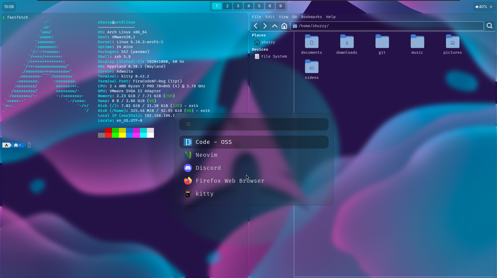

# 💧 ShuzzyOS


## 💿 Getting the ISO

<details>
  <summary><strong>🔥 Download (Recommended)</strong></summary>
    
  ### Download
    
  > ⚠️ Every **month** there is a new ISO, it is recommended to use the latest.
  
  - Download the ISO from the official [ShuzzyOS Download Page](https://shuzzy.duckdns.org/download).

  ---
</details>

<details>
  <summary><strong>🛠️ Build It Yourself</strong></summary>
    
  ### Build
    
  > ⚠️ This requires an **Arch-based system**.
  
  #### 1.📦 Install Required Packages
  
  ShuzzyOS uses the official `archiso` package to build the custom ISO:
  
  ```bash
  sudo pacman -S archiso
  ```
  #### 2.📁 Clone the Git Repository
  
  The repository contains everything you need to build, modify, and configure the ISO — including all relevant dotfiles.
  
  ```bash
  git clone https://github.com/RealShuzzy/ShuzzyOS.git
  ```
  
  #### 3.🔨 Build the ISO
  
  Run the following commands to build the ISO:
  
  ```bash
  cd ShuzzyOS
  mkarchiso -v -w ./iso/output -o ./iso/output ./iso/baseline/
  ```
  
  After the build completes, your ISO file will be located in:
  
  ```bash
  ./iso/output/
  ```

---
</details>


## 🔧 Creating a Bootable USB Drive
  
> ⚠️ Before installing **ShuzzyOS**, we need to make the **ISO bootable**.
  
   
<details>
  <summary><strong>🔥 Ventoy (Recommended)</strong></summary>
    
  ### Ventoy
    
  > ✅ **Ventoy** is a great way to create a **bootable** USB Device, simply by copying the ISO to the USB-Stick.
  
  #### 1.💾 Download Ventoy

  - Go to the official [Ventoy Download Page](https://www.ventoy.net/en/download.html) and install what fits your current OS.
  - Unzip the folder.
  
  #### 2.🔧 Format USB-Stick with Ventoy
  
  - Now execute the `Ventoy2Disk` and continue by selecting your USB-Stick and hitting `Install`.
  
  #### 3.▶️ Copy ISO onto the USB-Stick
  
  - Now we can finally use the ease of Ventoy by copying the ISO to the USB-Drivek.
  
  ---
</details>

<details>
  <summary><strong>⚙️ Rufus (Windows)</strong></summary>
    
  ### Rufus (Windows)
    
  > ⚠️ **Rufus** is a lightweight **Windows-only** tool to create a **bootable** USB Device.
  
  #### 1.💾 Download Rufus

  - Go to the official [Rufus Download Page](https://rufus.ie/en/#download) and install what fits your current OS.
  
  #### 2.🔧 Select USB-Drivee and ISO
  
  - Execute `rufus-(version)`
  - Select your USB-Drive under `Device`
  - Select the ISO under `Boot selection`
  
  #### 3.▶️ Start

  > ⚠️ **There is no need to change any settings.

  - Select `START` and wait until Rufus is done
  
  ---
</details>

<details>
  <summary><strong>⚙️ Balena Etcher</strong></summary>
    
  ### Balena Etcher
    
  > ✅ **Balena Etcher** is a **cross-platform** tool to create a **bootable** USB Device.
  
  #### 1.💾 Download Balena Etcher

  - Go to the official [Balena Etcher Download Page](https://etcher.balena.io/#download-etcher) and install what fits your current OS.
  
  #### 2.🔧 Select USB-Drive and ISO
  
  - Execute `balenaEtcher-(version).Setup`
  - Select the ISO under `Flash from file`
  - Select your USB-Drive under `Select Target`
  
  #### 3.▶️ Flash

  - Select `Flash!` and wait until Balena Etcher is done
  
  ---
</details>

## Install

> ⚠️ A **bootable USB-Drive** with the **ShuzzyOS ISO** is needed.

### Boot to the USB-Device

### Start the Installer
