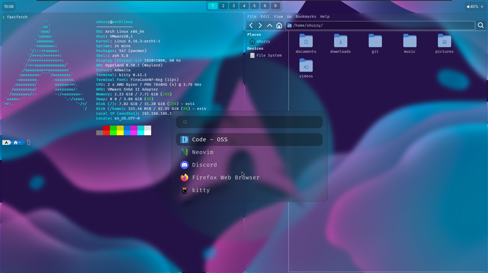

# ShuzzyOS

## Install
### Automated
Run this command to start the installer:
```
bash <(curl -sL https://raw.githubusercontent.com/RealShuzzy/ShuzzyOS/main/install.sh)
```
### Manual
Clone the GitHub Repository and start the script:

This script creates folder structures, so its recommended to clone the repo under `~/git` with the original name. 
```
mkdir -p ~/git
git clone https://github.com/RealShuzzy/ShuzzyOS.git ~/git
bash ~/git/ShuzzyOS/install.sh
```
